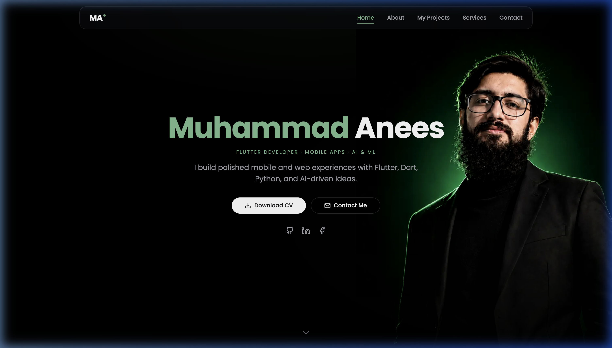

# Portfolio

A clean, responsive, dark-mode developer portfolio built with Next.js, Tailwind CSS, and Framer Motion.



## Built With

- **Next.js** — React framework (App Router)
- **Tailwind CSS** — Styling & Design System
- **Framer Motion** — Smooth animations & transitions

## Features

- **Responsive Design** — Optimized for desktop, tablet, and mobile devices
- **Hero & About Section** — Highlights background, experience, and CV download
- **Projects Showcase** — Features key projects with detail pages
- **Services & Skills** — Interactive display of technical capabilities
- **Contact Form** — Email contact setup with Nodemailer

## Getting Started

1. **Install dependencies:**

   ```bash
   npm install
   ```

2. **Set up environment variables:**

   ```bash
   cp .env.example .env.local
   ```

3. **Run the development server:**

   ```bash
   npm run dev
   ```

4. Open [http://localhost:3000](http://localhost:3000) in your browser.

